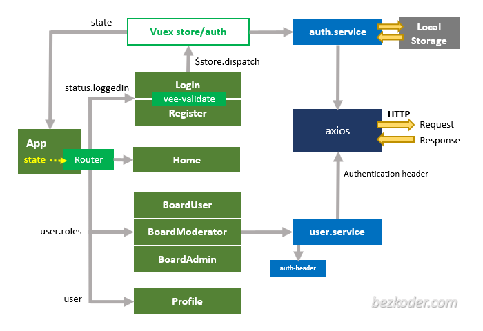

### 跨域配置

>浏览器的同源策略：js脚本在未经允许的情况下，不能够访问其他域下的内容。
>
>同源：协议，域名，端口都相同的则是同源，其中一个不同则不属于同源。

**同源策略主要限制三个方面**

1. 一个域下的js脚本不能访问另一个域下面的cookie，localStorage和indexDB
2. 一个域下的脚本不能操作另一个域下的DOM
3. ajax不能跨域请求

#### 一、后端解决

1. 方式一：编写配置类，实现WebMvcConfigurer接口，重写addCorsMappings方法；

```java
@Configuration
public class CrossConfig implements WebMvcConfigurer {
    @Override
    public void addCorsMappings(CorsRegistry registry) {
        registry.addMapping("/**")
                .allowedOriginPatterns("*")
                .allowedMethods("GET", "HEAD", "POST", "PUT", "DELETE", "OPTIONS")
                .allowCredentials(true)
                .maxAge(3600)
                .allowedHeaders("*");
    }
}
```

2.方式二：使用过滤器来处理跨域请求

```java
@Component
public class CorsFilter implements Filter {

    @Override
    public void doFilter(ServletRequest req, ServletResponse res, FilterChain chain)
            throws IOException, ServletException {
        HttpServletResponse response = (HttpServletResponse) res;
        HttpServletRequest request = (HttpServletRequest) req;
        response.setHeader("Access-Control-Allow-Origin", "*");
        response.setHeader("Access-Control-Allow-Methods", "GET, POST, PUT, DELETE");
        response.setHeader("Access-Control-Allow-Headers", "Content-Type, Authorization");
        response.setHeader("Access-Control-Max-Age", "3600");
        if ("OPTIONS".equals(request.getMethod())) {
            response.setStatus(HttpServletResponse.SC_OK);
        } else {
            chain.doFilter(req, res);
        }
    }
```

3. 方式三：请求的目标映射方法上加上**@CrossOrigin**

#### 二、前端解决

// todo

### 认证

#### session认证流程

1. 客户端向服务器发送用户名和密码。
2. 服务器验证通过后，在当前对话(session)里保存认证数据，比如用户角色，登录时间等。
3. 认证成功后服务器向用户返回一个 **session_id**，写入客户端的**Cookie**。
4. 客户端随后的每一次请求，都会通过cookie或请求头的方式，将session_id发回服务器。
5. 服务器接收到请求后，根据session_id查找对应的session对象，找到了则说明用户成功登录。

​	在上面的流程中，服务器需要维护一个Session列表，用于存储所有的session对象。在Java Web应用中，session对象通常通过HttpSession接口实现的，在SpringBoot应用中，可以通过Spring Session来实现session的管理。

**缺点：**

- **占用资源**：服务器需要维护一个session列表，这个列表可能会非常大，占用大量的内存和资源。且如果服务重启或崩溃，所有的session对象都会丢失，会导致用户需要重新登录。
- **无法使用**：session认证是基于cookie的，如果用户禁用了cookie，那么session认证就无法用了。
- **不安全**，session_id可能会被盗取，攻击者伪造用户的身份信息，进行一些非法操作。
- **无法跨域**：session认证通常无法跨域的，如果需要多个域名之间共享session，就需要使用其他方案了，例如使用redis做session共享，持久化session等，还有jwt等。

#### 基于token的认证流程

1. 用户登陆时，服务器端会生成一个token，并将token返回给客户端。
2. 客户端将token保存到Local Storage中，以便后续的请求中使用。
3. 客户端在后续的请求中，从Local Storage中获取token，并将token添加到请求头中。(见**客户端代码实现1**)
4. 服务端在接收到请求时，会从请求头中获取token，并验证token的有效性。(配置请求拦截器，拦截请求头中的token；见**服务端代码实现1**)
5. 根据token是否有效，服务端处理请求并返回相应的请求，客户端根据请求做出响应。

​	**服务端实现1**：springMVC中可以实现HandlerInterceptor接口，添加拦截规则；

```java
@Component
public class TokenInterceptor implements HandlerInterceptor {
    @Value("${token.secret}")
    private String secret;

    @Override
    public boolean preHandle(HttpServletRequest request, HttpServletResponse response, Object handler) throws Exception {
        String token = request.getHeader("Authorization");
        log.info("request intercepted");
        try {
            JWTUtils.verifyToken(token, secret);
        } catch (Exception e) {
            log.warn("token exception:{}", e.getMessage());
            throw new RuntimeException(e);
        }
        return true;
    }
}
```

​	在添加完拦截器后还需要注册并配置拦截规则，实现WebMvcConfigurer。

```java
@Configuration
public class WebMvcConfig implements WebMvcConfigurer{
  @Autowired
    private TokenInterceptor tokenInterceptor;

    @Override
    public void addInterceptors(InterceptorRegistry registry) {
        registry.addInterceptor(tokenInterceptor)
                .addPathPatterns("/**") //拦截所有请求
                .excludePathPatterns("/auth/login"); //放行登录接口，否则...
    }
}
```

​	**客户端实现1**：在前端vue中，可以使用axios请求拦截器来实现请求头添加token的功能。

```vue
axios.interceptors.request.use(
  config => {
    const token = localStorage.getItem('token')
    if (token) {
      config.headers.Authorization = `${token}`
    }
    return config
  },
  error => {
    return Promise.reject(error)
  }
)
// 存储token
localStorage.setItem('token', token)
```

​	使用axios响应拦截器实现服务器校验token失败、token过期等

```vue
axios.interceptors.response.use(
    response => response,
    error => {
				//根据不同响应码做不同处理
        if (error.response.status === 401) {
            router.push("/login").then(r => r)
        } else if (error.response.status === 500) {
            console.log("500");
            router.push("/login").then(r => r)
        }
        return Promise.reject(error)
    }
)
```


> 实际开发中，则还需要考虑token的过期时间、token的刷新机制，为了安全性，还需要使用加密技术来加密和验证token。

#### JWT

jwt由有点分割的三个部分组成：**Header**.**Payload**.**Signature**

- **Header**：是一个json对象，描述jwt的元数据，通常是下面的样子。**注意**：这个json需要Base64Url编码后才能放到jwt中。

```json
{
  "alg": "HS256", //alg algorithm 该属性表示签名的算法，默认是 HMAC SHA256（写成 HS256）
  "typ": "JWT"	//type属性表示这个token的类型，统一写为JWT
}
```

- **Payload**: 也是一个json对象，用来存放实际需要传递的数据。（**注意**：这个jso也是需要Base64Url编码后才能放到jwt中）JWT规定了7个官方字段，供选用（也可自定义）：

1. iss (issuer)：签发人

2. exp (expiration time)：过期时间

3. sub (subject)：主题

4. aud (audience)：受众

5. nbf (Not Before)：生效时间
6. iat (Issued At)：签发时间
7. jti (JWT ID)：编号

> 注意：对于已签名的令牌，虽然该信息收到保护，不会被篡改，但任何人都可以读取。除非加密，所以不要放一些私密的信息在Payload或Header中。

- **Signature**：它是对前两部分的签名，防止数据被篡改。首先需要指定一个secret，这个secret只有服务器知道。然后，使用Header里面的指定的签名算法。按照下面的公式产生签名，算出签名后，把Header和Payload、Signature三个部分组成一个字符串，每个部门用`.`分隔。返回给客户端。

```javascript
HMACSHA256(
  base64UrlEncode(header) + "." +
  base64UrlEncode(payload),
  secret)
/* Base64URL 介绍
Head和Payload串行化的算法是base64Url,这个算法和Base64算法基本类似，不同点是这个算法会将字符`+`,`/`,`=`替换掉，因为有时token会被放到url中。这就是Base64URL算法。
注意：Base64Url是一种编码，而不是加密过程，所以它是可逆的。
/
```

**jwt要做的事**

1. 生成token

```java
public static String buildToken(String username,String secret) {
        String token = JWT.create()
                .withClaim("username", username) //payload
                .sign(Algorithm.HMAC256(secret));//signature，
        log.info("token:\t{}", token);
        return token;
    }
```

2. 验证token

```java
public static void verifyToken(String token, String secret) {
        JWTVerifier jwtVerifier = JWT.require(Algorithm.HMAC256(secret)).build();
  			//decodedJWT即payload
        DecodedJWT decodedJWT = jwtVerifier.verify(token);
    }
```

在验证token的时候抛出异常，则说明验证不成功。有如下异常：根据捕获不同的异常，可更精确的返回异常信息，比如签名异常，token过期等。

- InvalidClaimException
- JWTVerificationException
- SignatureVerificationException
- TokenExpiredException

### spring-security

#### 项目整合

> 参考https://www.bezkoder.com/spring-boot-vue-js-authentication-jwt-spring-security/


#### security流程

##### 一、springboot项目中整合

- 引入依赖spring-boot-starter-security，整合了依赖之后，再次访问http请求就会被拦截到/login页面

  - 输入用户名user，密码在后台xxx;

- 更改从数据库中查询用户名和密码进行登录；

  - com.chen.security.login.service.LoginUser实现UserDetails接口，构造注入一个User；getPassword和getUsername返回User的username和password；
- 实现UserDetailsService接口，重写loadUserByUsername方法；
  
```java
@Service
@Slf4j
public class UserDetailsServiceImpl implements UserDetailsService {

  @Autowired
  private UserMapper userMapper;

  @Override
  public UserDetails loadUserByUsername(String username) throws UsernameNotFoundException {

    User user = userMapper.selectOne(new LambdaQueryWrapper<User>().eq(User::getUserName, username));
    log.debug("user:{}",user);
    return new LoginUser(user);
  }
}
```

- 配置SecurityFilterChain

```java
@Bean
SecurityFilterChain securityFilterChain(HttpSecurity httpSecurity) throws Exception {
  httpSecurity.authorizeRequests()
    //放行/user/get请求，放行的必须卸载anyRequest().authenticated()前面
    .mvcMatchers("/user/get").permitAll()
    .anyRequest().authenticated()
    .and()
    //开启login页面
    .formLogin()
    //登录成功处理器
    .successHandler(new MyAuthenticationSuccessHandler())
    //登陆失败处理器
    .failureHandler(new MyAuthenticationFailureHandler());
  return httpSecurity.build();
}
```


#### security整合vue,vuex


